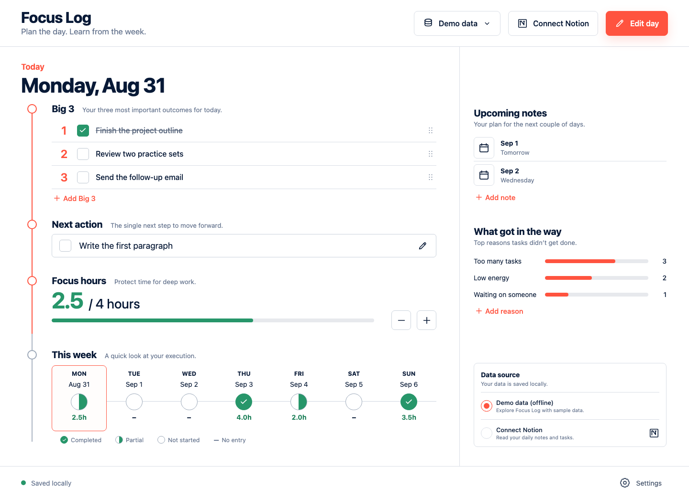
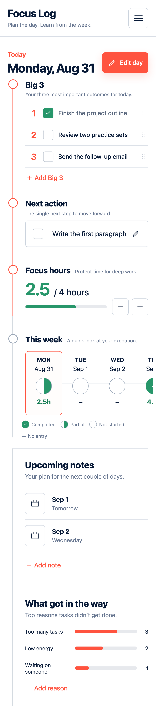

# Focus Log

Plan the day. Learn from the week.

[](https://github.com/AlfWuxy/focus-log-planner/actions/workflows/ci.yml)
[](https://github.com/AlfWuxy/focus-log-planner/actions/workflows/pages.yml)
[](LICENSE)

Focus Log is a small, open-source daily planning dashboard. Start instantly with realistic demo data, plan your Big 3 and next action, record focus time, then use the weekly view to see what helped or got in the way. The default experience runs entirely in the browser. An optional loopback-only server can read configured Notion data sources after the local tab is paired with a separate access key.

[Open the live demo](https://alfwuxy.github.io/focus-log-planner/) · [Report a bug](https://github.com/AlfWuxy/focus-log-planner/issues/new?template=bug_report.yml) · [Suggest an idea](https://github.com/AlfWuxy/focus-log-planner/issues/new?template=feature_request.yml)

## Screenshots

| Desktop | Mobile |
| --- | --- |
| [](docs/images/app-desktop.png) | [](docs/images/app-mobile.png) |

## 中文简介

Focus Log 是一个开源的日计划与周复盘小工具。你可以先用内置演示数据体验 Big 3、下一步行动、专注时长、未来笔记和未完成原因统计。演示模式无需账号，数据只保存在当前浏览器。需要时可在本机启动只读服务，从自己的 Notion 数据源读取数据。Notion token 与独立的本地配对密钥只放在 `.env.local`，都不会进入前端包或 Git 仓库。

## Features

- **Big 3 planning** for the three outcomes that matter today.
- **One next action** that turns a broad goal into a concrete move.
- **Focus-hour tracking** with a clear daily target and progress state.
- **Seven-day overview** for completed, partial, unstarted, and empty days.
- **Upcoming notes** for the next few days.
- **Friction patterns** that summarize common reasons work was left unfinished.
- **Responsive layout** designed for desktop and mobile.
- **Demo-first setup** with sample content and no account requirement.
- **Optional read-only Notion connection** through an authenticated loopback-only server using `Notion-Version: 2026-03-11`.

## Data modes

| Mode | Best for | Where data lives | Needs a server |
| --- | --- | --- | --- |
| Demo | Trying the app, GitHub Pages, offline planning | Current browser storage | No |
| Notion | Reading configured Daily and Notes data sources | Your Notion workspace; normalized responses pass through your local server | Yes |

The public GitHub Pages build always works in demo mode. It contains no real journal entries, database IDs, workspace links, or access tokens.

## Quick start

Requirements: [Node.js 22](https://nodejs.org/) and npm.

```bash
git clone https://github.com/AlfWuxy/focus-log-planner.git
cd focus-log-planner
npm ci
npm run dev
```

Open the local address printed by Vite. No `.env` file is needed for demo mode.

For an optional read-only Notion connection, follow [the Notion setup guide](docs/NOTION_SETUP.md), then run:

```bash
npm run dev:notion
```

## Test and build

```bash
npm run check
npx playwright install chromium
npm run test:e2e
```

`npm run check` runs linting, unit/component tests, TypeScript validation, and the production build. End-to-end tests use Playwright Chromium. GitHub Actions repeats both paths on every pull request.

Build a static demo locally with:

```bash
npm run build
npm run preview
```

## Privacy and security

- Demo content is synthetic and safe to publish.
- Browser data stays on the device unless you export or sync it yourself.
- The Notion token stays on the server side and belongs only in `.env.local` or an equivalent server environment.
- A separate local access key pairs the current browser tab with the loopback API and stays in `sessionStorage` for that tab session.
- The integration requests read access. Focus Log exposes no Notion write route.
- `.env`, private archives, test output, and build artifacts are ignored by Git.

Read [Privacy](docs/PRIVACY.md), [Notion setup](docs/NOTION_SETUP.md), and [Security Policy](SECURITY.md) before connecting personal data.

## Architecture

```text
GitHub Pages / browser
  -> React + TypeScript interface
  -> demo state in browser storage

Optional local setup
  -> React + TypeScript interface
  -> tab-scoped local access key
  -> authenticated local read-only API
  -> Notion API (2026-03-11)
```

The static app has no production backend dependency. The optional server binds to `127.0.0.1`, accepts only the fixed local frontend origin, requires a separate local access key, reads two configured Notion data sources, and returns no Notion token to the browser. See [Architecture](docs/ARCHITECTURE.md) for the detailed data flow.

## Origin and public rebuild

Focus Log was reconstructed from a local personal dashboard concept into a shareable React application. The public repository is a clean implementation with synthetic fixtures and documented privacy boundaries. Private workspace content, database identifiers, tokens, generated live results, and the recovered local archive are excluded.

The visual reference, scope decisions, and exclusion checklist are recorded in [Rebuild Notes](docs/REBUILD_NOTES.md).

## GitHub Pages

The [Pages workflow](.github/workflows/pages.yml) builds the demo from `main` with the repository base path and deploys `dist/`. In the repository settings, choose **GitHub Actions** as the Pages source. The optional Notion server is intentionally outside the Pages deployment.

## Contributing

Issues and focused pull requests are welcome. Start with [CONTRIBUTING.md](CONTRIBUTING.md), follow the [Code of Conduct](CODE_OF_CONDUCT.md), and keep sample data fictional.

## License

Focus Log is available under the [MIT License](LICENSE).
